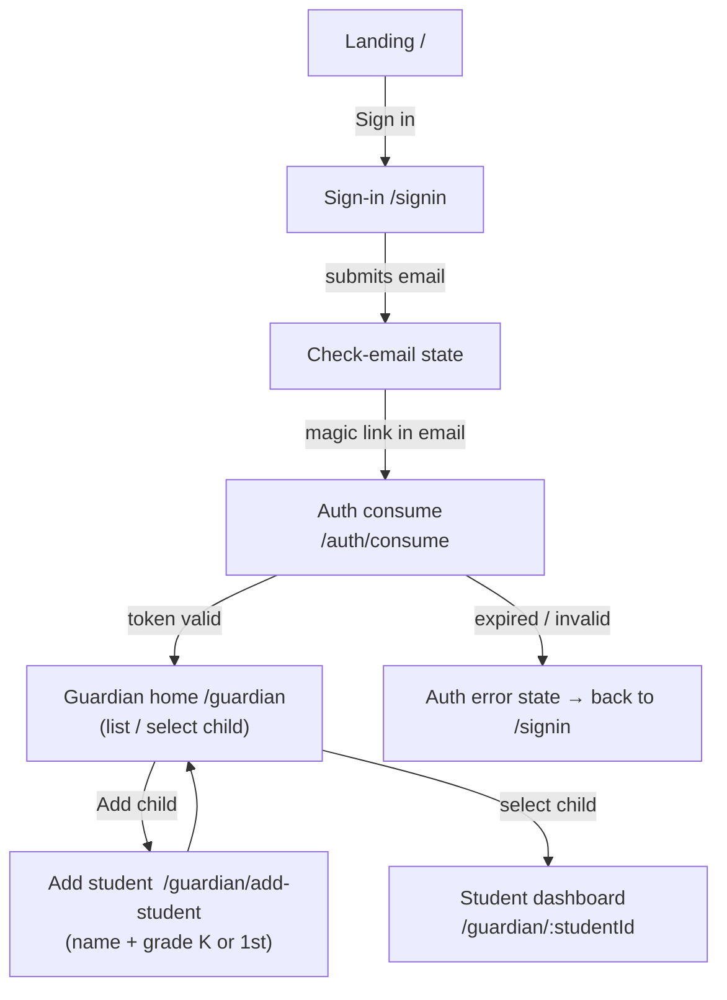
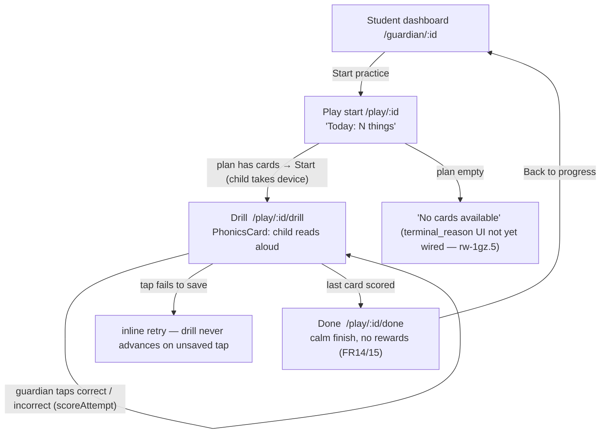
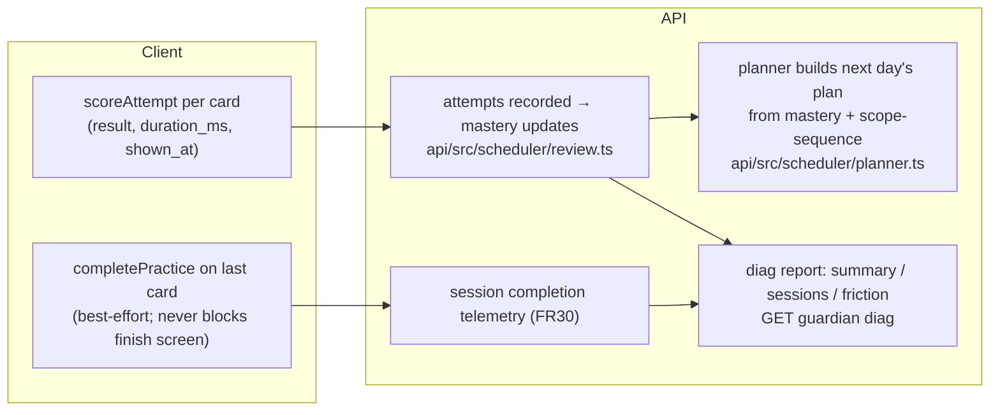

# Reader's Way — User Journeys (Phase A)

**Status:** draft, 2026-07-03
**Type:** user flow map (screens + actions) with a system lane for progress tracking
**Sources:** `app/src/App.tsx` routing (verified 2026-07-03), Spec 002 FR34 screen list, scheduler in `api/src/scheduler/`
**Related:** [Spec 002](../specs/002-readers-way-phase-a-micro-pilot.md), plans 002d–002h, 003a

This is the canonical map of how a pilot user gets from first contact to a completed
session, and how progress is recorded behind the scenes. Each journey lists the open
beads that change it, tagged by which pilot wave gates them (family `rw-odv`,
educator `rw-1ge`). Update this doc when routes or the scheduler contract change;
`app/src/App.tsx` is the ground truth for paths.

## Two-wave pilot sequencing (decided 2026-07-03)

The pilot runs as two waves with distinct gates, tracked as milestone beads:

- **Family wave** (`rw-odv`, start gated on audio, time-boxed ~Aug 1): recordings
  in and playing (`rw-ozz` stage 1, owner judgment suffices; `rw-5j6` adult-modeled
  fallback if the time-box triggers) + audio playback engineering (`rw-1gz.8.2`) +
  Resend issuer flip on the **shared** sender at workers.dev (`rw-1gz.7.3`) +
  multi-child verified (`rw-1gz.12`) + drill-surface polish subset (`rw-ir1`).
  Landing, privacy/terms, domain, SLP sign-off, and the full 002h pass are **not**
  family-wave gates.
- **Educator wave** (`rw-1ge`): family wave running + SLP check-off (`rw-ozz`
  stage 2) + domain purchase & verified Resend sending domain (`rw-840`) +
  landing (002f) + privacy/terms (002g) + full 002h polish/a11y pass +
  magic-link rate limiting (`rw-1gz.7.4`).
- Device posture is **genuinely mixed** — 002h's 375/768/1280 breakpoints all
  carry equal weight.

## Journey 1 — Guardian onboarding (first contact → child ready)

Notes
- Family wave: magic link arrives via Resend **shared** sender on workers.dev;
  branded domain sender is an educator-wave gate (`rw-840`).
- Grade selection at add-student is the *only* placement input (FR7, NG3/NG4).
  K starts at sequence beginning (FR8); 1st grade starts on the fast-advance
  review ramp (FR9/FR10), both enforced server-side by the planner.

Remaining work in this journey

| Step | Bead | Wave | What changes |
| --- | --- | --- | --- |
| Check-email → magic link | `rw-1gz.7.3` | family | Real Resend issuer flip (shared sender) so pilot emails actually send |
| Magic-link request | `rw-1gz.7.4` | educator | Exact three-per-email/15-minute cap plus a production 10-per-IP/minute abuse backstop; throttling remains non-enumerating |
| Landing entry | `rw-1gz.9.1` → `rw-1gz.9.2` | educator | Real landing copy + LandingRoute build-out (FR25, AC13) |
| Landing/email URL + sender | `rw-840` | educator | Domain purchase + verified Resend sending domain |
| Add student | `rw-1gz.6` | family (polish) | Render onboarding copy constants in AddStudentRoute |
| Guardian home with 2+ kids | `rw-1gz.12` | family | Verify K + 1st siblings under one guardian |

## Journey 2 — Practice session (dashboard → drill → done)

The device changes hands here: the guardian navigates to Start, then the child
holds the device while the guardian taps scoring.

Notes
- Scoring is **guardian-confirmed tapping**: the child reads, the adult taps how
  it went. Automatic speech scoring is a deferred evaluation (`rw-gx3`).
- Session state lives in localStorage between cards (`loadPractice`/`advancePractice`),
  so a mid-session refresh resumes rather than restarts.
- Audio is the family-wave critical path: recordings first (`rw-ozz`, time-boxed
  ~Aug 1), playback engineering in parallel (`rw-1gz.8.2`), adult-modeled
  fallback only if the time-box triggers (`rw-5j6`).

Remaining work in this journey

| Step | Bead | Wave | What changes |
| --- | --- | --- | --- |
| Drill card modes | `rw-qjk` | family | Mode-aware cards: PA answer line, heart-part highlighting, fluency copy (plan 002i) |
| Drill card audio | `rw-1gz.8.2` | family | Gesture playback + TTS words/sentences (003a Tasks 5–11) |
| Drill card audio assets | `rw-ozz` | family | Recorded 44 sounds through pipeline; SLP check-off later gates educator wave |
| Sound cards w/o recordings | `rw-5j6` | family (contingency) | Adult-modeled "say it together" card state if Aug 1 slips |
| Whole drill loop | `rw-ir1` | family | Drill-surface polish subset (start/drill/done at 375/768/1280) |
| Empty plan state | `rw-1gz.5` | family (polish) | Surface 1st-grade review-exhausted `terminal_reason` instead of bare "No cards" |
| Card content quality | `rw-1gz.8.5` | educator | Decodability gate models digraphs/blends, not just single letters |
| Scoring interaction | `rw-gx3` | post-pilot | Evaluate guardian-confirmed automatic speech scoring |

## Journey 3 — How progress is tracked (system lane)

Where progress becomes visible:

| Surface | Route | Who | Shows |
| --- | --- | --- | --- |
| Student dashboard | `/guardian/:studentId` | guardian | overall correct/attempts + per-skill breakdown (from diag summary) |
| Play start | `/play/:studentId` | child + guardian | today's plan size ("Today: N things") |
| Diag report | `/guardian/diag` | operator | sessions, completion, friction rows — the Phase A exit-marker evidence |

Remaining work in this journey

| Step | Bead | Wave | What changes |
| --- | --- | --- | --- |
| Next-day plan selection | `rw-ncu` | family | Planner consumes mastery/due_at: missed items return, mastered rotate out (plan 002i) |
| Full SM-2 + skill manager | `rw-5kd` | post-family | Spec 001 §6 fidelity (streak gates, ease, graduation) — back-test with replay after pilot data |
| Diag report | `rw-1gz.13` | family (exit) | Surface spec 002 exit-marker reads (10+ sessions / 2+ households) directly in the report |
| Dashboard per-skill list | `rw-1gz.11` (noted) | educator | Human-readable skill names instead of raw `skill_id` codes |
| Planner input integrity | `rw-brf` | infra | Validate grade field values + grade-ordering test in content-validate |

## Journey 4 — Support (manual, FR37–39)

Contact is a `mailto:` route surfaced on landing + privacy/terms. Deletion, email
change, and data export are operator-manual via direct D1 access (NG2/FR39). No
in-app journey exists by design for Phase A.

Remaining work in this journey

| Step | Bead | Wave | What changes |
| --- | --- | --- | --- |
| Support email exists | `rw-1gz.9.1` | educator | `support.email` constant lands in packages/copy |
| Legal pages + contact | `rw-1gz.10.1` → `rw-1gz.10.2` | educator | Plain-language Privacy/Terms drafted, then routes + mailto |
| Operator data access | `rw-bpb` | infra (pre-educator) | D1 preview/production split so support surgery can't hit the wrong data |

## Bead coverage check (2026-07-03)

Every open/in-progress bead maps to a journey or is deliberately non-journey:

| Bead | Journey | Notes |
| --- | --- | --- |
| rw-1gz.7.3, 7.4, 9.1, 9.2, 840, 1gz.6, 1gz.12 | J1 | onboarding |
| rw-1gz.8.2, ozz, 5j6, ir1, qjk, 1gz.5, 1gz.8.5, gx3 | J2 | practice |
| rw-1gz.13, ncu, 5kd, brf (+ skill-name note on 1gz.11) | J3 | progress |
| rw-1gz.10.1, 10.2, bpb (+ 9.1 shared) | J4 | support |
| rw-1gz.11, 11.1, 11.2 | J1–J3 sweep | cross-cutting FR34 polish/a11y pass (educator gate) |
| rw-odv, rw-1ge | — | wave milestones; umbrellas over the rows above |
| rw-jvh | — | the architecture review itself (meta) |
| rw-1gz, 1gz.7, 1gz.8, 1gz.9, 1gz.10 | — | epics; children mapped above |

## Gaps observed while mapping (tracked)

- Empty plan shows a bare "No cards available" — the 1st-grade review-exhausted
  `terminal_reason` isn't surfaced yet (`rw-1gz.5`).
- Dashboard per-skill list renders raw `skill_id` codes to guardians; fine for
  family wave, worth a copy pass before educators (folded into `rw-1gz.11` notes).
- `StudentSettingsRoute` is a stub ("Mic practice is off"); harmless but should
  either gain content or lose its nav link in the educator polish pass
  (folded into `rw-1gz.11` notes).
